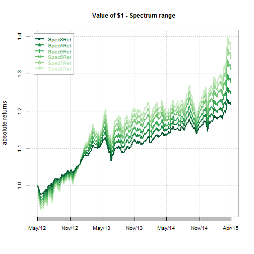
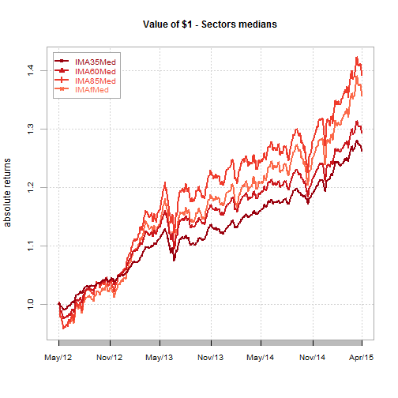
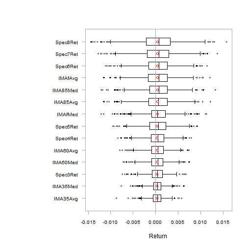
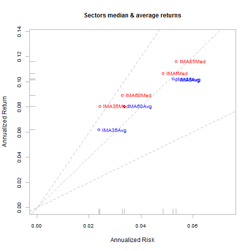
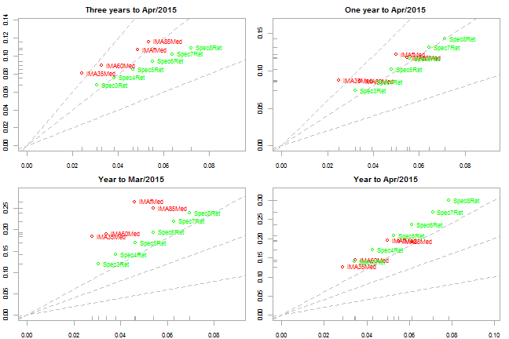
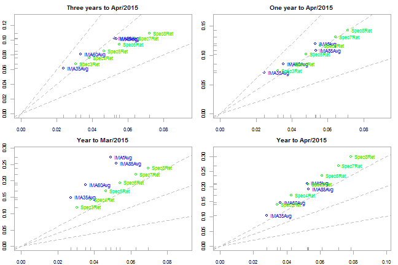

# Introduction
This quick analysis tries to replicate what was presented during the last 2015 Q1 QIC by the Multi Asset team.

The raw data and all the relevant R scripts are published on <http://www.github.com/mcastagnaa/SpectrumAnalysis> and available there for replication to anybody interested.
This is an R Markdown document\footnote{Markdown is a simple formatting syntax for authoring HTML, PDF, and MS Word documents. For more details on using R Markdown see <http://rmarkdown.rstudio.com>.}. 

The relevant R packages used (with all the relevant dependencies) are:


```r
require(PerformanceAnalytics)
```

```
## Warning: package 'PerformanceAnalytics' was built under R version 3.0.3
```

```
## Warning: package 'xts' was built under R version 3.0.3
```

```
## Warning: package 'zoo' was built under R version 3.0.3
```

# The dataset
The raw data for the relevant sectors \footnote{The sectors considered where *IA Mix 0-35 Shares*, *IA Mix 20-60 Shares*, *IA Mix 40-85 Shares*, *IA Mix flex*} were sourced from \textit{Morningstar} capturing the Median return and the Average returns with a daily frequency.

The difference between the median returns and the average ones are substantial by construction. While the average returns are built daily by Morningstar on an unbiased basis (in terms of survivorship bias), the median ones are calculated manually by the \textit{OMGI Investment Risk and Performance Team} filtering each sector as of today and going back in time calculating each period median returns: the result is a time series of survivorship-biased returns.

The filter admits only the oldest share class for each product (excluding insurance funds) using (as an example for the \textit{IA Mix 0-35} sector) the following definition:
```
"SUPER_CLIENT:/INDEX_LISTS/PEER_GROUPS/Sector - IMA - Mixed Investment 0-35 Shares - PTX"
```
The sector averages uses the IA Methodology of the daily average returns of the most expensive share class for each fund.

Specturm funds prices are taken as delivered by Citi to OMGI. The Specturm prices are published by class on a Bid/Mid/Offer basis. For this exercise the Mid price was used for the OA class.
Mid price seems to be the logical option in order to avoid any excess volatility due to prices swings; the OA class has the longest time series (TS).

From the Prices TS the returns TSs are built for the Spectrum funds using the following sintax computing simple returns:

```r
FundPRes$Spec3Ret <- c(NA, FundPRes$Mid.SKSPEC3[2:n]/FundPRes$Mid.SKSPEC3[1:n-1]-1)
FundPRes$Spec4Ret <- c(NA, FundPRes$Mid.SKSPEC4[2:n]/FundPRes$Mid.SKSPEC4[1:n-1]-1)
FundPRes$Spec5Ret <- c(NA, FundPRes$Mid.SKSPEC5[2:n]/FundPRes$Mid.SKSPEC5[1:n-1]-1)
FundPRes$Spec6Ret <- c(NA, FundPRes$Mid.SKSPEC6[2:n]/FundPRes$Mid.SKSPEC6[1:n-1]-1)
FundPRes$Spec7Ret <- c(NA, FundPRes$Mid.SKSPEC7[2:n]/FundPRes$Mid.SKSPEC7[1:n-1]-1)
FundPRes$Spec8Ret <- c(NA, FundPRes$Mid.SKSPEC8[2:n]/FundPRes$Mid.SKSPEC8[1:n-1]-1)
```

The basic dataset is built (by matching the relevant dates) loading the sectors returns and the Spectrum funds returns.

The combined dataset is saved with name \textit{CombByDate.Rda}.


```r
rm(list =ls(all=TRUE))
load("CombByDate.Rda")
firstDate <- min(CombByDate$Date)
firstDate
```

```
## [1] "2012-04-30"
```

```r
lastDate <- max(CombByDate$Date)
lastDate
```

```
## [1] "2015-04-30"
```

# Data inspection
 

 


 
\newpage
Inspection of the entire dataset sorted by variance (check for outliers).



# Risk/Return analysis vs. sectors medians
The first panel (Panel 1) provides evidence of where in the risk/reward space the Spectrum range is, compared with the sector medians.

Four datasets are considered (from top to bottom, left to right) where different start/end dates have been used:
\begin{enumerate}
  \item full three year set
  \item last 12 month
  \item Year to date to end of March
  \item Year to date to end of April (to make sure we appreciate the effect of the last couple of weeks)
\end{enumerate}

The evidence shows the fund range under the sector medians for the first three charts while the improvement during the last month is cleary visible in the fourth.
In the YtD chart to the last data point, the fund range is aligned to the sector median risk/return points.

# Risk/Return analysis vs. sectors averages
The same logic is applied using sectors averages (Panel 2). In this case we believe the reference should make the comparison less aggressive. 
By using the sector average returns we compare the funds with the sectors statistics incuding those funds that were closed out (or moved to a different sector) during the period. It also true, as detailed above, the averages are composed with the most expensive share classes for each product. In all likelihood you would expect those returns to be lower than the one obtained with the survivorship-biased (older share class) medians.
That should be particularly helpful over the longer horizon (3 years) limiting the distance of the Spectrum range vs. the peer group.

The chart below seems to confirm that hypothesis.



# Conclusions
Last month was a good month for the Spectrum range helping the products aligning themselves with the average products in the sector.
Over the long period the range is still behind that target.
\newpage
\begin{landscape}
\textbf{Panel 1: Spectrum funds vs. Sector medians}

\newpage
\textbf{Panel 2: Spectrum funds vs. Sector averages}


\end{landscape}
